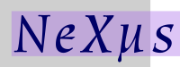

## The NeXus Logo
This directory contains the official logo (and variants) of the NeXus organisation.
* NeXus_Logo.svg: official NeXus logo
* NeXus_Logo_square.svg: favicon variant
* NeXus_Logo_dark.svg: variant for dark backgrounds
* NeXus_Logo_dark_square.svg: favicon variant for dark backgrounds

While the SVG versions are recommended for use, further PDF and EPS versions are provided in the `vector_formats` directory, and PNG versions (converted by inkscape using the 'make_pngs.py script)
are provided in multiple resolutions in the `bitmap` directory.

## Guidelines for Use
In general, we want the logo to be used as widely as possible to indicate use of the NeXus format and the work of the NeXus organisation. However, please [ask first](https://www.nexusformat.org/NIAC.html) when you wish to use a derived version of the logo, when you wish to sell items that feature the NeXus logo (or a derived version), or when in doubt.

In most cases, the `NeXus_Logo` file is the most appropriate Logo to use. The `NeXus_Logo_dark` file is recommended when the logo is to be included in a colour scheme that involves light text on a dark background. The `NeXus_Logo_square` and `NeXus_Logo_dark_square` are recommended for use as small icons, for example in web browser tabs.
